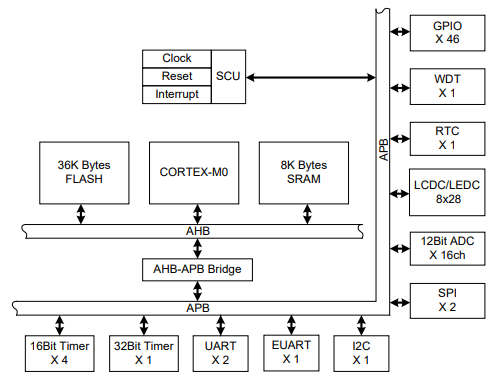

# [HR8P506](https://github.com/SoCXin/HR8P506)

#### [Vendor](https://github.com/SoCXin/Vendor) ：[Eastsoft](http://www.essemi.com/)
#### [Core](https://github.com/SoCXin/Cortex)：[Cortex M0](https://github.com/SoCXin/CM0)
#### [Level](https://github.com/SoCXin/Level) ：48 MHz * 0.95 DMIPS/MHz

## [HR8P506简介](https://github.com/SoCXin/HR8P506/wiki)

[HR8P506](https://github.com/SoCXin/HR8P506)

#### 关键特性

* LCDC(8 x 28)
* PWM
* RTC
* 工作电压 2.2V ~ 5.5V

### [资源收录](https://github.com/SoCXin/HR8P506)

* [参考文档](docs/)
* [参考资源](src/)
* [参考工程](project/)

### [选型建议](https://github.com/SoCXin)

[HR8P506](https://github.com/SoCXin/HR8P506)

###  [SoC.芯](http://www.SoC.Xin)
